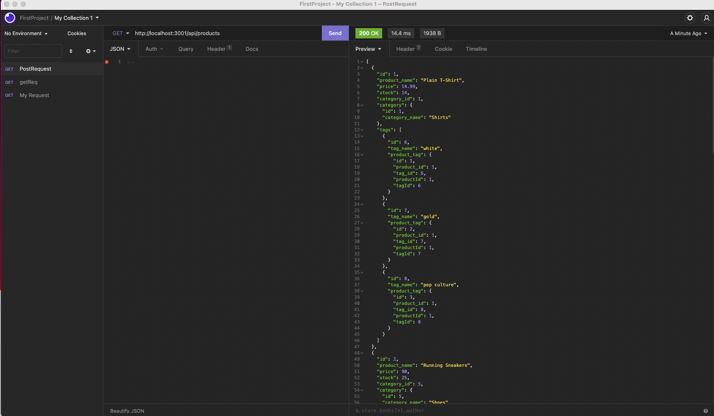
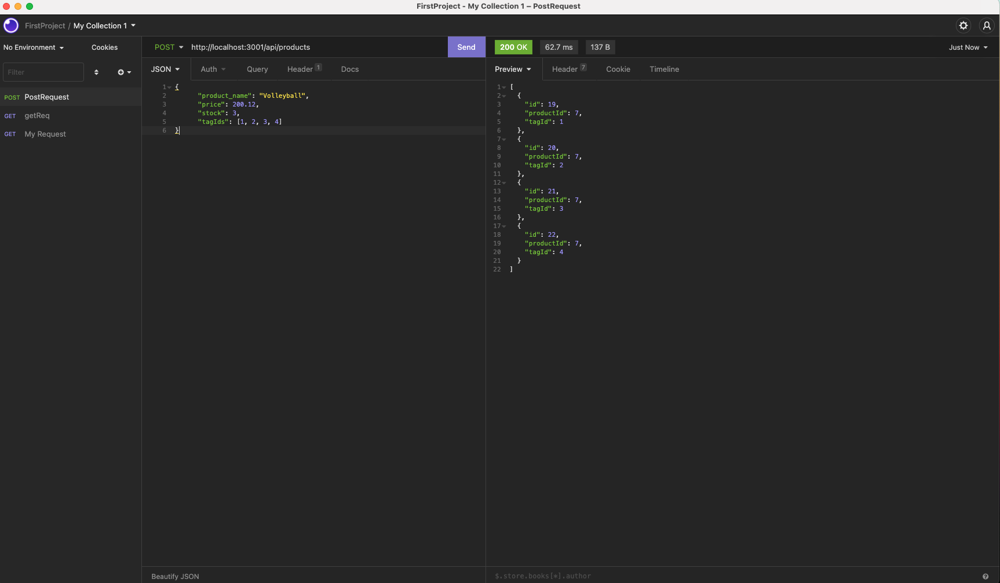

# E-Commerce

[Demo URL 1 ](https://github.com/SanjeevKumar-DEV/E-Commerce) 

[Demo URL 2 ](https://github.com/SanjeevKumar-DEV/E-Commerce) 

[Repository URL ](https://github.com/SanjeevKumar-DEV/E-Commerce)

## Description

> It is baceknd application to facilitate 
> sequelize based JSON routes where Product, 
> Category and Tags and Products tags are the 
> main objects. GET, POST, PUT and DELETE are 
> the main methods supported in these routes 
> for PRODUCT, Category and Tags.  

## Table of Contents

- [Installation](#Installation)
- [Usage](#Usage)
- [Contributing](#Contributing)
- [Tests](#Tests)
- [Questions](#Questions)
- [License](#License)

## Installation

Clone the repository using the repository URL as mentioned below.
```
git clone git@github.com:SanjeevKumar-DEV/E-Commerce.git
```
Open Terminal and go to cloned repository location and fire code editor
```
Code .
```
Start your server
```
npm start
```
Start using this application bu invoking REST API Client POSTMAN or Insomnia 

## Usage

> Get Routes for Products 

 

> Product Post Routes 

 


## Contributing

> In Progress 

 


## Tests

> Test Development in Progress 

## Questions

> Q1. What is my link to my github profile ? 
Answer: [Github Username](https://github.com/SanjeevKumar-DEV) 

> Q2. How to reach me with additional questions ? 
Answer: [Contact Email](mailto:sanjeevkumar@me.com)

## License

> NPM and GNU
